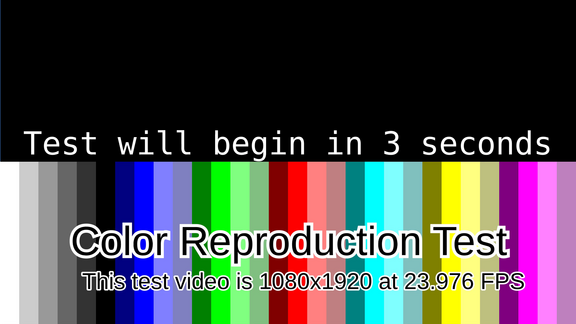
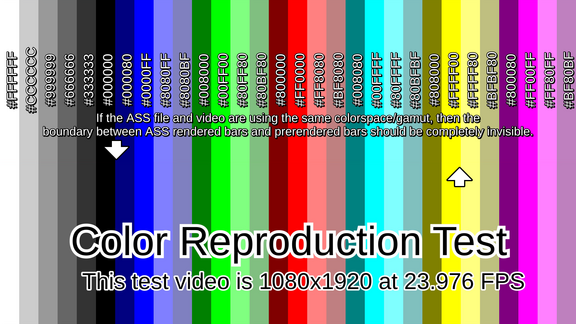
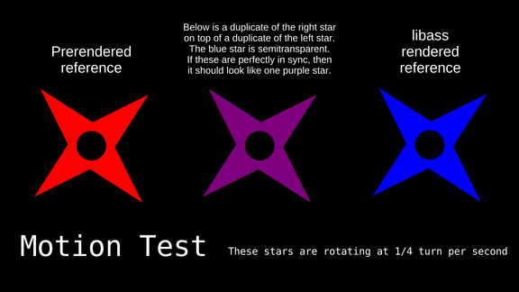

# ASS Render Test

If the output of your version of libass is wildly deviant from what it should be, then this should in theory help you detect it.

This project was created out of anger and paranoia that things are not as they seemed. My anger and paranoia was proven to be largely unjustified.

### Screenshots

